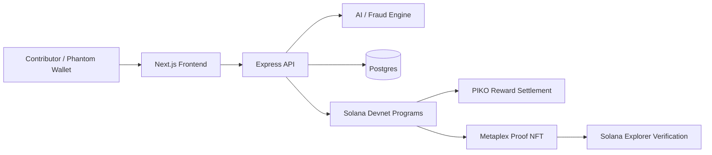

# PIKO Protocol

AI-powered contributor intelligence and verifiable on-chain reputation infrastructure for decentralized communities.

## Problem

Decentralized communities spend treasury on grants, quests, campaigns, and activation programs, but often lack a credible way to tell which contributions are valuable, human, and repeatable. The result is wasted incentives, weak attribution, and reputation that stays trapped inside one dashboard instead of becoming composable on-chain history.

## Solution

PIKO Protocol turns contribution actions into scored, verifiable reputation events. A contributor completes an action, the system evaluates payment, location, identity signal, behavioral risk, and reward economics, then settles the result on Solana and can mint a proof NFT that is independently inspectable.

This is not presented as complete identity verification or production-grade fraud prevention. The current prototype demonstrates behavioral fraud analysis, reputation scoring, partial World ID-style identity architecture, Solana settlement, and Metaplex proof NFTs.

## Why Solana

Solana makes the loop practical because confirmations are fast, fees are low, and contribution proofs can be composed with wallets, NFTs, token rewards, and future community tooling. Devnet is used for the hackathon demo so judges can inspect real transactions without mainnet cost.

## Why NFTs

NFTs are used as portable contribution proofs, not collectibles. The NFT mint links the contribution to metadata such as merchant/community context, payment verification, location verification, fraud score, multiplier, and identity signal.

## Colosseum Positioning

Lead with three ideas:

- Contributor intelligence: AI scores payment, location, identity, and behavioral signals before rewards settle.
- Treasury control: reward logic is budget-aware, so communities can fund incentives without treating every action equally.
- Metaplex proofs: each verified contribution can become a portable on-chain reputation artifact.

Full strategy: [COLOSSEUM_STRATEGY.md](./COLOSSEUM_STRATEGY.md)

## Demo in 10 Seconds

1. Open the map.
2. Tap the merchant or contribution opportunity.
3. Connect Phantom and approve the devnet action/payment.
4. AI evaluates the contribution and reward logic.
5. PIKO settles and a proof NFT can be verified in Explorer.

Some internal package names still use the legacy repo namespace for build continuity, but every public-facing surface should present `PIKO Protocol`.

## Run the Demo

```bash
npm install
npm run dev
```

Open these URLs:

- Main app: `http://localhost:3000/`
- Optional judge kiosk: `http://localhost:3000/?demo=1`
- Focused controlled flow: `http://localhost:3000/demo-flow?demo=1`
- Merchant simulation: `http://localhost:3000/merchant/cafe-bloom`
- System reveal console: `http://localhost:3000/demo`

For final submission, record both:

- The controlled narrative flow for a clean explanation.
- The live Phantom flow for wallet approval, devnet transaction, NFT mint, and Explorer verification.

## What Judges Should Experience

`/?demo=1` is the optional controlled judge path:

1. See one merchant pin: **Cafe Bloom**.
2. Tap it.
3. Start the incentive flow, or open the merchant profile to see the economics dashboard.
4. Run the controlled scoring event.
5. See a structured decision receipt with fraud score, payment proof, location proof, and final reward.
6. See the reward and proof NFT result.

## Architecture

The architecture is separated into:

- `programs/` - Solana programs for registry and incentive state.
- `packages/ai` - fraud scoring, reward optimization, and merchant intelligence.
- `packages/server` - API layer for merchants, incentives, payments, AI, and rewards.
- `apps/web` - mobile-first demo client and judge-facing flows.
- `packages/common` - shared types and utilities.

Full breakdown: [ARCHITECTURE.md](./ARCHITECTURE.md)



## Verified Devnet Proofs

- Proof NFT mint: `CuHFGnfMK4J5aMMbBFT3FJgPjinxp3adKPHNbK5iQRYb`
- NFT Explorer: `https://explorer.solana.com/address/CuHFGnfMK4J5aMMbBFT3FJgPjinxp3adKPHNbK5iQRYb?cluster=devnet`
- Reward transaction: `https://explorer.solana.com/tx/54ZtxcCPbGCcFBD3pVqE7w74EaUsqZeiRPyfhPoqxY441nANBAz2dKbxrh25huMTzJzVzpDKncKpy7usEUtiGYMZ?cluster=devnet`
- Metadata URI: `https://piko-protocol-web.vercel.app/metadata/contributor.json`
- Proof image: `https://piko-protocol-web.vercel.app/nft/contributor-proof.svg`
- Merchant registry program: `3GyfAzucGoL1FFpkhpCm3sRjTCjLxPyeFLp4vayw35GH`
- Quest program: `21qTx6xMKjy4v23BbfGvM1mSKvkk3bNVHvgSnXZEMcpC`

## Quick Start

Prerequisites:

- Node.js 18+
- PostgreSQL
- Redis
- Rust toolchain
- Solana CLI
- Anchor CLI

Environment:

1. Copy `.env.example` to `.env`.
2. Fill in the required values.

Important variables:

- `DATABASE_URL`
- `REDIS_URL`
- `SOLANA_RPC_URL`
- `SOLANA_WS_URL`
- `NEXT_PUBLIC_SOLANA_RPC_URL`
- `ANCHOR_WALLET`
- `PIKO_MINT_AUTHORITY_WALLET`
- `PIKO_MINT_ADDRESS`
- `PIKO_DECIMALS`
- `MERCHANT_REGISTRY_PROGRAM_ID`
- `QUEST_PROGRAM_ID`
- `OPENROUTER_API_KEY`
- `OPENROUTER_MODEL`
- `OLLAMA_URL`
- `OLLAMA_MODEL`
- `NEXT_PUBLIC_API_URL`
- `JWT_SECRET`
- `LOG_LEVEL`
- `PORT`

Database and local services:

```bash
npm run db:push
npm run db:seed
```

Anchor:

```bash
npm run anchor:build
npm run anchor:test
```

Deployment verification:

```bash
npm install
npm run build
npm run lint
npm run test
npm run anchor:build
```

Before any judge demo, keep `Anchor.toml` on devnet and verify the app still degrades cleanly when Redis, AI inference, NFT minting, RPC confirmation, or wallet connection is unavailable.

## Scripts

| Command | Description |
| --- | --- |
| `npm run dev` | Run web app and server through Turbo |
| `npm run dev:web` | Run only the Next.js app |
| `npm run dev:server` | Run only the Express API |
| `npm run build` | Build all workspaces |
| `npm run lint` | Run workspace lint tasks |
| `npm run test` | Run workspace tests |
| `npm run db:push` | Push Prisma schema |
| `npm run db:seed` | Seed merchant data |
| `npm run anchor:build` | Build Anchor programs |
| `npm run anchor:test` | Run Anchor tests |
| `npm run anchor:deploy` | Deploy Anchor programs |

## Current Limitations

- World ID is represented through a stored proof/nullifier flow for the demo; production SDK verification is still future work.
- Fraud scoring is behavioral and rules/LLM-assisted, not a complete Sybil-resistance system.
- The controlled `/demo-flow` path is a reliable narrative demo; the live Phantom path should be recorded separately before submission.
- Devnet is used for hackathon verification.

## Project Status

This repo already has the full loop:

`discover -> claim -> AI score -> reward -> NFT`

The main work now is presentation, clarity, and demo quality, not core architecture.
