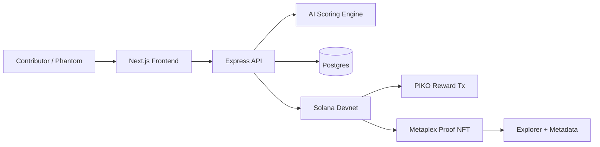

# PIKO Protocol Submission Package

## One-Line Pitch

AI-powered contributor intelligence and verifiable on-chain reputation infrastructure for decentralized communities.

## Project Description

Decentralized communities spend treasury on campaigns, quests, grants, and real-world activation, but they often lack reliable contributor intelligence. A wallet can claim a task, but the community still needs to know whether the action was useful, human, paid for, location-valid, and worth the reward.

PIKO Protocol turns contribution actions into scored, verifiable reputation events. A contributor connects a wallet, completes an action, and the system evaluates payment, location, identity signal, behavioral risk, and reward economics. Approved actions settle on Solana and can mint a Metaplex proof NFT that carries contribution metadata.

Solana is the right substrate because reputation events should be cheap, fast, inspectable, and composable. Devnet transactions and proof NFT mints make the demo independently verifiable through Solana Explorer.

The prototype includes a Next.js frontend, Express API, AI/fraud scoring package, Postgres state, Solana programs, PIKO reward settlement, and Metaplex proof NFT minting. It is a hackathon-level infrastructure prototype, not a claim of complete Sybil resistance or production-grade fraud prevention.

## Architecture Diagram

## Demo Video Script

Target length: 2:30-2:45.

### 0:00-0:20 - Problem

"Communities spend treasury on incentives, quests, and activation campaigns, but they often cannot tell which contributions are valuable, human, and worth rewarding. PIKO turns those actions into scored, verifiable reputation events."

Show the map or controlled demo screen.

### 0:20-0:40 - Solution

"A contributor connects Phantom, completes an action, and PIKO evaluates payment, location, identity signal, behavioral risk, and budget-aware reward logic. Approved actions settle on Solana and mint a portable proof NFT."

Briefly show the architecture diagram.

### 0:40-1:50 - Product Walkthrough

1. Open `http://localhost:3000/`.
2. Connect Phantom on devnet.
3. Open a quest/contribution flow.
4. Trigger the payment/action.
5. Approve the transaction in Phantom.
6. Show the AI decision receipt.
7. Show the reward/NFT result.

Cut loading time if devnet RPC is slow.

### 1:50-2:20 - Explorer Verification

Show:

- NFT mint on Solana Explorer
- Reward transaction on Solana Explorer
- Metadata URI and proof image

Use the verified links below.

### 2:20-2:45 - Technical Highlight

"The important piece is that the proof is not just a UI badge. The backend mints a Metaplex NFT with structured metadata, and the reward decision is anchored to the payment, identity signal, location signal, fraud score, and reward multiplier."

End with the honest scope:

"This is a devnet prototype with behavioral fraud analysis and partial World ID-style identity architecture. The next step is production identity verification, stronger fraud calibration, and community integrations."

## Explorer Links

- Proof NFT mint: `CuHFGnfMK4J5aMMbBFT3FJgPjinxp3adKPHNbK5iQRYb`
- NFT Explorer: `https://explorer.solana.com/address/CuHFGnfMK4J5aMMbBFT3FJgPjinxp3adKPHNbK5iQRYb?cluster=devnet`
- Reward transaction: `https://explorer.solana.com/tx/54ZtxcCPbGCcFBD3pVqE7w74EaUsqZeiRPyfhPoqxY441nANBAz2dKbxrh25huMTzJzVzpDKncKpy7usEUtiGYMZ?cluster=devnet`
- Metadata URI: `https://piko-protocol-web.vercel.app/metadata/contributor.json`
- Proof image: `https://piko-protocol-web.vercel.app/nft/contributor-proof.svg`
- Merchant registry program: `3GyfAzucGoL1FFpkhpCm3sRjTCjLxPyeFLp4vayw35GH`
- Quest program: `21qTx6xMKjy4v23BbfGvM1mSKvkk3bNVHvgSnXZEMcpC`

## Safe Claims

Use:

- Behavioral fraud analysis
- Reputation scoring
- Budget-aware reward logic
- Portable contribution proofs
- Partial World ID-style identity architecture
- Devnet Solana settlement

Avoid:

- Fully solved Sybil resistance
- Production-grade fraud prevention
- Complete identity verification
- Guaranteed bot prevention

## Two-Minute Talk Track

"PIKO Protocol is contributor intelligence infrastructure for decentralized communities. Communities spend treasury on quests, grants, events, and activation, but they often cannot tell which actions are valuable or worth rewarding. PIKO evaluates each contribution using payment, location, identity signal, behavioral risk, and reward economics.

The frontend lets a contributor connect Phantom and complete an action. The backend records the claim, runs AI-assisted scoring, settles the reward on Solana, and can mint a Metaplex proof NFT. That NFT is portable evidence of the contribution, with metadata that can be inspected in Explorer.

Solana matters because this type of reputation event needs to be cheap, fast, and composable. NFTs matter because reputation should not be trapped in our app. AI matters because every contribution should not be rewarded equally; communities need scoring and guardrails before treasury is spent.

This is a devnet prototype. It demonstrates the full loop, but it does not claim complete Sybil resistance or production-grade fraud prevention. The current version shows behavioral fraud analysis, partial identity architecture, real chain writes, and verifiable proof metadata."

## Final Submission Checklist

- Demo video under 3 minutes
- README has problem, solution, Solana rationale, NFT rationale, limitations
- Architecture diagram included
- Explorer links included
- Phantom flow recorded separately from controlled demo flow
- No claims of complete identity verification or fully solved fraud
- No placeholder public-facing names
- Devnet clearly labeled
